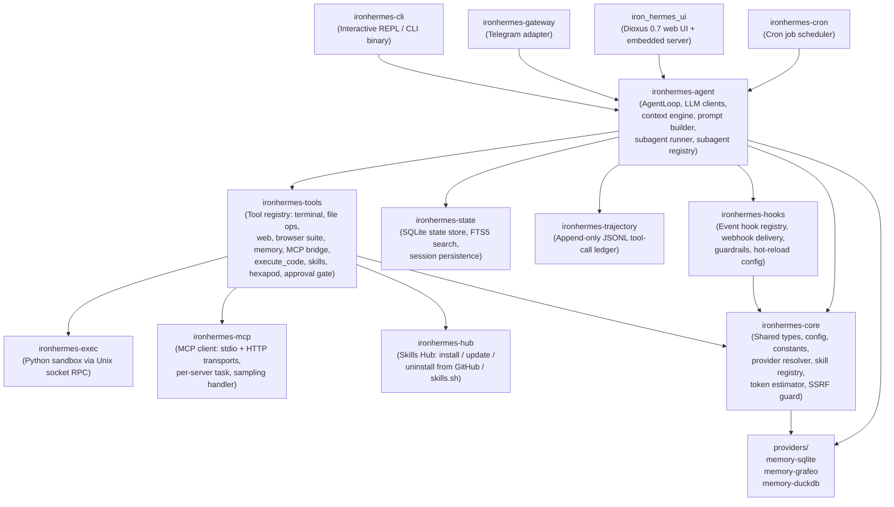

<!-- generated-by: gsd-doc-writer -->
# Architecture

## System Overview

IronHermes is a self-improving AI agent runtime written in Rust, ported from the Python [hermes-agent](https://github.com/NousResearch/hermes-agent) by Nous Research. The system accepts user prompts through multiple entry points (interactive CLI, Telegram gateway, or a web UI), runs an agentic loop that calls an LLM and dispatches tool calls, and returns streamed responses. The architecture is a Cargo workspace of focused crates organized in a layered style: shared types and configuration at the base, an agent engine in the middle, and multiple frontends at the top. An embedded Dioxus 0.7 web application (`iron_hermes_ui`) bundles the agent server directly, exposing a terminal-style chat shell over HTTP and WebSocket without a separate process.

---

## Component Diagram



---

## Data Flow

A typical request moves through the system in the following order:

1. **Entry point receives input.** The CLI REPL (`ironhermes-cli`) reads a line from the terminal via a dedicated `ReplInputChannel` thread. The Telegram gateway (`ironhermes-gateway`) polls for updates and places them in a per-user `UserQueueManager`. The web UI (`iron_hermes_ui`) receives input via Dioxus fullstack server functions and a WebSocket handler, forwarding it to an in-process agent server.

2. **Session is created or resumed.** The entry point opens (or reuses) a session record in the SQLite `StateStore` (`ironhermes-state`). A `workspace_root` is resolved from the current working directory and stored frozen on the session row.

3. **Prompt is built.** `PromptBuilder` in `ironhermes-agent` assembles the system prompt from the agent identity string, loaded context files (CLAUDE.md / AGENTS.md walk-up), active skill contents, and any pending memory entries from the pluggable `MemoryManager`.

4. **AgentLoop runs.** `AgentLoop` sends the conversation history to an `AnyClient` (which wraps either `AnthropicClient` or an OpenAI-compatible endpoint via `reqwest`, with optional fallback provider). It streams `StreamEvent` chunks back, accumulating the assistant response. A `ContextEngine` (either `LocalPruningEngine` for hard pruning or `SummarizingEngine` for soft compression via an aux model) monitors token pressure and trims the conversation history as needed.

5. **Tool calls are dispatched.** When the LLM response contains tool calls, `AgentLoop` dispatches each one through `ToolRegistry` in `ironhermes-tools`. Before executing any dangerous command, the `approval` module checks the yolo configuration flag. Tools include `terminal`, `read_file` / `write_file` / `patch` / `search_files`, `web_search` / `web_read` / `web_extract`, a full browser control suite (`navigate`, `click`, `type`, `press`, `scroll`, `back`, `close`, `snapshot`, `get_images`, vision), `execute_code` (Python sandbox via `ironhermes-exec`), `delegate_task` (subagent spawning via `AgentSubagentRunner`), `memory_tool`, hexapod robot tools (`hexapod_tcp`, `hexapod_video`), and any MCP-bridged tools registered by `McpManager`.

6. **Hook events are fired.** Before and after significant operations, `HookRegistry` from `ironhermes-hooks` dispatches `HookEvent` records to registered listeners (JSONL log writer, webhook delivery with retry queue, guardrail interceptors).

7. **Trajectory is appended.** After each tool result, `ironhermes-trajectory` appends a `TrajectoryEntry` (tool name, arguments, result, impact level) to a per-session JSONL file under `<workspace-or-home>/.ironhermes/sessions/<id>/trajectories.jsonl`.

8. **Messages are persisted.** Each assistant turn and tool result is stored as a `StoredMessage` row in `ironhermes-state`. FTS5 triggers keep the `messages_fts` virtual table in sync for full-text search.

9. **Response is streamed back.** The entry point receives the `AgentResult` and streams the final text to the user (terminal output, Telegram message, or WebSocket frames to the browser).

---

## Key Abstractions

| Abstraction | Kind | File | Description |
|---|---|---|---|
| `AgentLoop` | struct | `crates/ironhermes-agent/src/agent_loop.rs` | Drives the LLM ↔ tool-call loop; holds budget, context compressor, cancellation token, trajectory handle |
| `AnyClient` | enum | `crates/ironhermes-agent/src/any_client.rs` | Unified LLM client wrapping `AnthropicClient` or an OpenAI-compatible client; wires fallback provider |
| `LlmClient` | struct | `crates/ironhermes-agent/src/client.rs` | Core streaming LLM client |
| `ToolRegistry` | struct | `crates/ironhermes-tools/src/registry.rs` | Stores and dispatches all registered `Tool` implementations by name |
| `Tool` | trait | `crates/ironhermes-tools/src/registry.rs` | Single async `execute()` method; every tool (terminal, file, web, browser, etc.) implements this |
| `RegistryToolsetSession` | struct | `crates/ironhermes-tools/src/toolset_session.rs` | Production `ToolsetSessionHandle` impl for the live REPL / Telegram / single-shot binary; mutates in-session `ToolsConfig` without writing to disk |
| `StateStore` | struct | `crates/ironhermes-state/src/lib.rs` | SQLite-backed session + message store; schema v8; WAL mode with FTS5 full-text search |
| `Config` | struct | `crates/ironhermes-core/src/config.rs` | Deserialized from `~/.ironhermes/config.yaml`; holds provider, model, tools, gateway, exec, hub, and memory config |
| `ProviderResolver` | struct | `crates/ironhermes-core/src/provider.rs` | Resolves a named provider to a `ResolvedEndpoint` (base URL + API key); handles custom providers and env var lookup |
| `HookRegistry` | struct | `crates/ironhermes-hooks/src/registry.rs` | Broadcast hub for `HookEvent`s; supports sync and async listeners, guardrails, and webhook delivery |
| `SkillRegistry` | struct | `crates/ironhermes-core/src/skills.rs` | Discovers, loads, and validates installed skill bundles from `~/.ironhermes/skills/` |
| `McpManager` | struct | `crates/ironhermes-mcp/src/manager.rs` | Spawns per-server tokio tasks over stdio or HTTP; bridges MCP tools into `ToolRegistry` |
| `Sandbox` | struct | `crates/ironhermes-exec/src/sandbox.rs` | Launches a Python subprocess with tool access via JSON-RPC over a Unix domain socket |
| `TrajectoryWriter` | struct | `crates/ironhermes-trajectory/src/writer.rs` | Append-only, fsync-per-line JSONL writer for per-tool-call audit records |
| `GatewayRunner` | struct | `crates/ironhermes-gateway/src/runner.rs` | Telegram polling loop with backoff, rate limiting, PID file management, and per-user queuing |
| `PromptBuilder` | struct | `crates/ironhermes-agent/src/prompt_builder.rs` | Assembles system prompt from identity string, context files, skill contents, and memory entries |
| `ContextCompressor` | struct | `crates/ironhermes-agent/src/context_compressor.rs` | Shrinks conversation history when approaching context limits via summarization |
| `ContextEngine` | trait | `crates/ironhermes-agent/src/context_engine.rs` | Abstraction over context management strategies; implementations include `LocalPruningEngine` (hard truncation) and `SummarizingEngine` (LLM-based soft compression, defined in `crates/ironhermes-agent/src/summarizing_engine.rs`) |
| `SubagentRegistry` | struct | `crates/ironhermes-agent/src/subagent_registry.rs` | In-memory session-scoped registry tracking live subagent tasks by ID, path, and cancellation token |
| `AppRuntimeBundle` | struct | `crates/ironhermes-agent/src/app_runtime_factory.rs` | Single factory output wiring all agent dependencies (client, tools, state, hooks, trajectory) for a run |

---

## Directory Structure Rationale

```
ironhermes/
├── crates/
│   ├── ironhermes-core/        # Shared foundation: types, config, constants, error, provider
│   │                           # resolution, skill registry, token estimator, SSRF guard.
│   │                           # Everything else depends on this; it depends on nothing internal.
│   ├── ironhermes-state/       # SQLite persistence layer (sessions, messages, FTS5 search).
│   │                           # Intentionally separate so the gateway and CLI share one store.
│   ├── ironhermes-agent/       # Agent engine: LLM clients, AgentLoop, prompt builder, context
│   │                           # engine (local prune / summarizing), subagent runner + registry,
│   │                           # memory manager. The core "brain".
│   ├── ironhermes-tools/       # Tool registry and all tool implementations. Kept separate from
│   │                           # the agent so tools can be composed without pulling in the loop.
│   ├── ironhermes-cli/         # Interactive CLI binary (REPL, ratatui TUI, slash commands,
│   │                           # status/session/toolset/skills subcommands).
│   ├── ironhermes-gateway/     # Telegram messaging gateway: polling, rate limiter, PID lock,
│   │                           # session management, multimodal attachment handling.
│   ├── ironhermes-hooks/       # Event hook system: JSONL logging, webhook delivery, guardrails,
│   │                           # hot-reload config watcher.
│   ├── ironhermes-trajectory/  # Append-only JSONL per-tool-call audit ledger (D-T-1 spec).
│   ├── ironhermes-exec/        # Python sandbox runtime — executes scripts via Unix socket RPC,
│   │                           # with tool dispatch back into the agent's ToolRegistry.
│   ├── ironhermes-hub/         # Skills Hub client: install/update/uninstall from GitHub or
│   │                           # skills.sh; tarball verification, lock file, trust management.
│   ├── ironhermes-mcp/         # Model Context Protocol client: stdio + HTTP transports,
│   │                           # per-server reconnecting tasks, sampling handler.
│   ├── ironhermes-cron/        # Cron job scheduler for time-triggered agent invocations.
│   └── iron_hermes_ui/         # Dioxus 0.7 fullstack web application — terminal-style chat
│                               # shell with an embedded Axum server and agent instance.
├── providers/
│   ├── memory-sqlite/          # SQLite-backed memory provider implementation.
│   ├── memory-grafeo/          # Grafeo graph-based memory provider implementation.
│   └── memory-duckdb/          # DuckDB-backed memory provider implementation.
├── skills/                     # Bundled built-in skills shipped with the binary.
├── optional-skills/            # Additional skills available for manual install.
├── scripts/
│   └── deploy/                 # OS-detecting installer/uninstaller for gateway as a
│                               # launchd (macOS) or systemd --user (Linux) service.
├── docker/                     # Docker-related assets.
├── Dockerfile                  # Container build for the gateway or CLI.
└── Cargo.toml                  # Workspace root: lists all member crates, shared deps.
```

---

## Crate Dependency Graph

The layering is strict — lower layers have no knowledge of higher layers:

```
iron_hermes_ui ─────────────────────────┐
ironhermes-cli ──────────────────────┐  │
ironhermes-gateway ───────────────┐  │  │
ironhermes-cron ──────────────┐   │  │  │
                              ↓   ↓  ↓  ↓
                         ironhermes-agent
                              ↓        ↓
              ironhermes-tools     ironhermes-state
              ↓    ↓    ↓    ↓          ↓
        exec  hub  mcp  core       ironhermes-trajectory
                         ↓
                   ironhermes-hooks
                         ↓
                   ironhermes-core
                         ↓
                   providers/memory-*
```

`ironhermes-core` is the only crate imported by every other crate. `ironhermes-state` and `ironhermes-trajectory` are siblings with no dependency on each other. `ironhermes-hooks` depends on `ironhermes-core` only. All tool logic lives in `ironhermes-tools`; the agent engine depends on tools but tools do not depend on the agent engine (they call back via the `ToolDispatch` trait in `ironhermes-exec` for sandbox RPC).

---

## Concurrency Model

The runtime is `tokio`-based throughout. Key concurrency patterns:

- **Agent loop** runs inside a single `tokio` task; tool calls are dispatched sequentially within a turn (parallel tool dispatch is not currently used).
- **Gateway** uses one polling task per platform adapter and a `UserQueueManager` to serialize concurrent requests from the same user.
- **Web UI** runs an embedded Axum server; each chat request spawns an agent task and streams `ChatStreamEvent` frames over a WebSocket or server-sent events channel.
- **MCP servers** each run in a dedicated `tokio` task (producing `ServerTaskResult`) with reconnection backoff; they communicate with the agent via `Arc<Mutex<ToolRegistry>>`.
- **Python sandbox** (`ironhermes-exec`) runs as a child `tokio::process::Command`; the host communicates over a Unix domain socket using JSON-RPC, with a configurable RPC-call ceiling and timeout.
- **Hook delivery** uses an async broadcast channel; webhook retries use a `RetryQueue` polled by a background task.
- **Input channel** in the CLI hosts `rustyline` on a dedicated OS thread and bridges it into `tokio` via an `mpsc` channel so the REPL can `tokio::select!` between user input and an in-flight agent turn.
- **Subagent registry** tracks in-flight `delegate_task` subagents per session via `SubagentRegistry`, each holding a `CancellationToken` so the parent agent can cancel child tasks on timeout or early exit.
