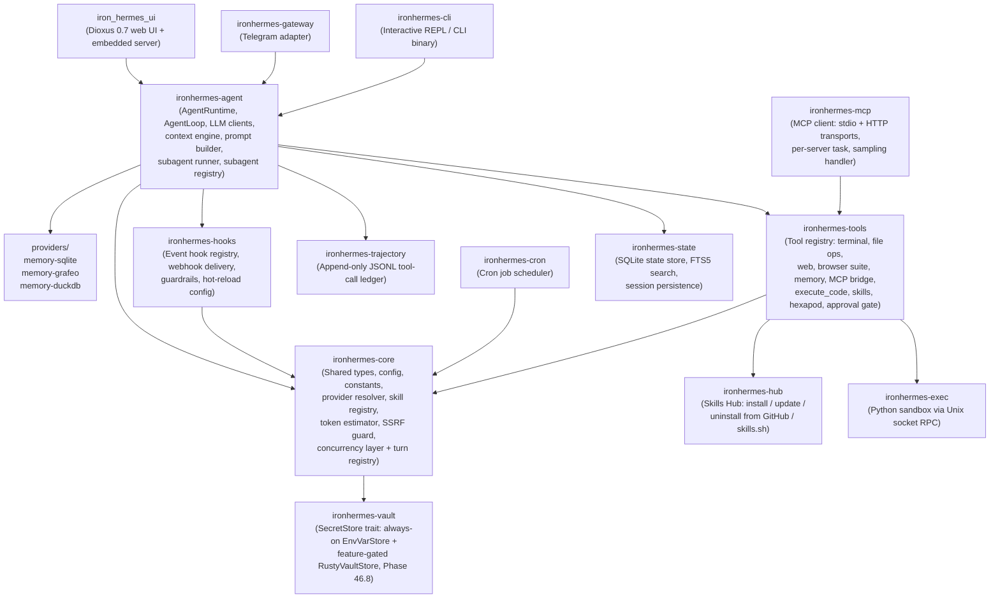

<!-- generated-by: gsd-doc-writer -->
# Architecture

## System Overview

IronHermes is a self-improving AI agent runtime written in Rust, ported from the Python [hermes-agent](https://github.com/NousResearch/hermes-agent) by Nous Research. The system accepts user prompts through multiple entry points (interactive CLI, Telegram gateway, or a web UI), runs an agentic loop that calls an LLM and dispatches tool calls, and returns streamed responses. The architecture is a Cargo workspace of focused crates organized in a layered style: shared types and configuration at the base, an agent engine in the middle, and multiple frontends at the top. An embedded Dioxus 0.7 web application (`iron_hermes_ui`) bundles the agent server directly, exposing a terminal-style chat shell over HTTP and WebSocket without a separate process. As of the async-agents work (Phase 39.1), turns within a single session run **concurrently** — a long-running agent turn no longer blocks the chat channel — governed by a shared concurrency layer and a process-wide turn registry in `ironhermes-core`. The web UI additionally offers a hands-free **voice-to-voice** mode that opens an OpenAI Realtime session over WebRTC directly from the browser. Provider API keys are resolved through a layered `ProviderResolver` (config > environment variable > built-in default); as of Phase 46.8, an optional pluggable secret-vault backend (`ironhermes-vault`) can be consulted as a last-resort fallback when explicitly enabled in config.

---

## Component Diagram


```mermaid
graph TD
    CLI["ironhermes-cli\n(Interactive REPL / CLI binary)"]
    GW["ironhermes-gateway\n(Telegram adapter)"]
    UI["iron_hermes_ui\n(Dioxus 0.7 web UI + embedded server)"]

    AGENT["ironhermes-agent\n(AgentRuntime, AgentLoop, LLM clients,\ncontext engine, prompt builder,\nsubagent runner, subagent registry)"]

    TOOLS["ironhermes-tools\n(Tool registry: terminal, file ops,\nweb, browser suite, memory, MCP bridge,\nexecute_code, skills, hexapod, approval gate)"]

    CORE["ironhermes-core\n(Shared types, config, constants,\nprovider resolver, skill registry,\ntoken estimator, SSRF guard,\nconcurrency layer + turn registry)"]

    STATE["ironhermes-state\n(SQLite state store, FTS5 search,\nsession persistence)"]

    TRAJ["ironhermes-trajectory\n(Append-only JSONL tool-call ledger)"]

    HOOKS["ironhermes-hooks\n(Event hook registry, webhook delivery,\nguardrails, hot-reload config)"]

    EXEC["ironhermes-exec\n(Python sandbox via Unix socket RPC)"]

    HUB["ironhermes-hub\n(Skills Hub: install / update /\nuninstall from GitHub / skills.sh)"]

    MCP["ironhermes-mcp\n(MCP client: stdio + HTTP transports,\nper-server task, sampling handler)"]

    CRON["ironhermes-cron\n(Cron job scheduler)"]

    MEM["providers/\nmemory-sqlite\nmemory-grafeo\nmemory-duckdb"]

    VAULT["ironhermes-vault\n(SecretStore trait: always-on EnvVarStore +\nfeature-gated RustyVaultStore, Phase 46.8)"]

    CLI --> AGENT
    GW  --> AGENT
    UI  --> AGENT

    AGENT --> TOOLS
    AGENT --> STATE
    AGENT --> TRAJ
    AGENT --> HOOKS
    AGENT --> CORE

    TOOLS --> EXEC
    MCP   --> TOOLS
    TOOLS --> HUB
    TOOLS --> CORE

    AGENT --> MEM
    HOOKS --> CORE
    CRON  --> CORE
    CORE  --> VAULT
```

Additional crates not shown above to keep the diagram legible: `ironhermes-cron-runner` (executes a due cron job end-to-end by driving an `AgentRuntime` turn — separate from `ironhermes-cron`, which only schedules), `ironhermes-kanban` (durable work-queue kernel for the kanban task subsystem), `ironhermes-artifacts` (per-profile SQLite store for agent-authored webpages), and `ironhermes-blackbox` (append-only event recorder for agent turns). See Directory Structure Rationale and Crate Dependency Graph below for how each attaches.

---

## Data Flow

A typical request moves through the system in the following order:

1. **Entry point receives input.** The CLI REPL (`ironhermes-cli`) reads a line from the terminal via a dedicated `ReplInputChannel` thread. The Telegram gateway (`ironhermes-gateway`) polls for updates and places them in a per-user `UserQueueManager`. The web UI (`iron_hermes_ui`) receives input via Dioxus fullstack server functions and a WebSocket handler, forwarding it to an in-process agent server.

2. **Session is created or resumed.** The entry point opens (or reuses) a session record in the SQLite `StateStore` (`ironhermes-state`). A `workspace_root` is resolved from the current working directory and stored frozen on the session row.

3. **Prompt is built.** `PromptBuilder` in `ironhermes-agent` assembles the system prompt from the agent identity string, loaded context files (CLAUDE.md / AGENTS.md walk-up), active skill contents, and any pending memory entries from the pluggable `MemoryManager`.

4. **AgentRuntime drives the turn.** Channels build one `AgentRuntime` per logical agent at startup (gateway = one interactive runtime + one separate cron runtime; web = one per server; CLI `run_chat`/TUI = one per session; `run_single` = one per process). Each turn becomes a `TurnRequest` (messages, session id, cancel token, stream callbacks) handed to `AgentRuntime::run_turn`, which resets the shared `BudgetHandle`, assembles `AgentLoop` with all durable wiring (registry, hooks, skills, browser, memory, fallback, compression, context engine), and runs the loop. `AgentLoop` sends the conversation history to an `AnyClient` (which wraps either `AnthropicClient` or an OpenAI-compatible endpoint via `reqwest`, with optional fallback provider). Provider API keys backing `AnyClient` are resolved once at startup by `ProviderResolver::build` (config > env var > built-in default); when `config.vault.enabled` is true, `ProviderResolver::apply_vault_fallback` additionally consults a pluggable `SecretStore` (`ironhermes-vault`) for any endpoint still missing a key, propagating a hard error if the backend is sealed or unreachable rather than silently running keyless. It streams `StreamEvent` chunks back, accumulating the assistant response. A `ContextEngine` (either `LocalPruningEngine` for hard pruning or `SummarizingEngine` for soft compression via an aux model) monitors token pressure and trims the conversation history as needed. Since Phase 39.1, multiple turns for the same session may be in flight at once: each turn is admitted by the `ConcurrencyLayer` (per-session cap + process-wide global ceiling), registered in the process-wide `TurnRegistry` with its originating `Surface` and a `CancellationToken`, and deregistered on completion; turns beyond the cap queue in FIFO order. Streamed `ChatStreamEvent` frames are labelled with a `turn_id` so concurrent turns can be demultiplexed by the client.

5. **Tool calls are dispatched.** When the LLM response contains tool calls, `AgentLoop` dispatches each one through `ToolRegistry` in `ironhermes-tools`. Before executing any dangerous command, the `approval` module checks the yolo configuration flag. Tools include `terminal`, `read_file` / `write_file` / `patch` / `search_files`, `web_search` / `web_read` / `web_extract`, a full browser control suite (`navigate`, `click`, `type`, `press`, `scroll`, `back`, `close`, `snapshot`, `get_images`, vision), `execute_code` (Python sandbox via `ironhermes-exec`), `delegate_task` (subagent spawning via `AgentSubagentRunner`), `memory_tool`, hexapod robot tools (`hexapod_tcp`, `hexapod_video`), and any MCP-bridged tools registered by `McpManager`.

6. **Hook events are fired.** Before and after significant operations, `HookRegistry` from `ironhermes-hooks` dispatches `HookEvent` records to registered listeners (JSONL log writer, webhook delivery with retry queue, guardrail interceptors).

7. **Trajectory is appended.** After each tool result, `ironhermes-trajectory` appends a `TrajectoryEntry` (tool name, arguments, result, impact level) to a per-session JSONL file under `<workspace-or-home>/.ironhermes/sessions/<id>/trajectories.jsonl`.

8. **Messages are persisted.** Each assistant turn and tool result is stored as a `StoredMessage` row in `ironhermes-state`. FTS5 triggers keep the `messages_fts` virtual table in sync for full-text search.

9. **Response is streamed back.** The entry point receives the `AgentResult` and streams the final text to the user (terminal output, Telegram message, or WebSocket frames to the browser).

---

## Key Abstractions

| Abstraction | Kind | File | Description |
|---|---|---|---|
| `AgentRuntime` | struct | `crates/ironhermes-agent/src/agent_runtime.rs` | Durable, channel-agnostic agent unit. Owns client, registry, budget, skills, hooks, browser session, and memory. Built once per logical agent; `run_turn(TurnRequest)` is the single per-turn entry point used by every channel |
| `TurnRequest` | struct | `crates/ironhermes-agent/src/agent_runtime.rs` | Per-turn input assembled by the channel: messages, session id, cancel token, stream + tool callbacks. Everything that legitimately varies turn-to-turn |
| `AgentLoop` | struct | `crates/ironhermes-agent/src/agent_loop.rs` | Drives the LLM ↔ tool-call loop; holds budget, context compressor, cancellation token, trajectory handle. Assembled per-turn inside `AgentRuntime::run_turn` |
| `AnyClient` | enum | `crates/ironhermes-agent/src/any_client.rs` | Unified LLM client wrapping `AnthropicClient` or an OpenAI-compatible client; wires fallback provider |
| `LlmClient` | struct | `crates/ironhermes-agent/src/client.rs` | Core streaming LLM client |
| `ToolRegistry` | struct | `crates/ironhermes-tools/src/registry.rs` | Stores and dispatches all registered `Tool` implementations by name |
| `Tool` | trait | `crates/ironhermes-tools/src/registry.rs` | Single async `execute()` method; every tool (terminal, file, web, browser, etc.) implements this |
| `RegistryToolsetSession` | struct | `crates/ironhermes-tools/src/toolset_session.rs` | Production `ToolsetSessionHandle` impl for the live REPL / Telegram / single-shot binary; mutates in-session `ToolsConfig` without writing to disk |
| `StateStore` | struct | `crates/ironhermes-state/src/lib.rs` | SQLite-backed session + message store; schema-versioned via forward migrations; WAL mode with FTS5 full-text search |
| `Config` | struct | `crates/ironhermes-core/src/config.rs` | Deserialized from `~/.ironhermes/config.yaml`; holds provider, model, tools, gateway, exec, hub, and memory config |
| `ProviderResolver` | struct | `crates/ironhermes-core/src/provider.rs` | Resolves a named provider to a `ResolvedEndpoint` (base URL + API key); precedence is config > env var > built-in default. `apply_vault_fallback` (Phase 46.8) optionally consults a `SecretStore` as the last-resort source for any endpoint still missing a key |
| `SecretStore` | trait | `crates/ironhermes-vault/src/lib.rs` | Pluggable secret-storage backend (get/put/delete/list); `EnvVarStore` is always-on, `RustyVaultStore` is feature-gated behind the `rusty-vault` cargo feature. Zero-cycle leaf crate — `ironhermes-core` depends on it, never the reverse |
| `HookRegistry` | struct | `crates/ironhermes-hooks/src/registry.rs` | Broadcast hub for `HookEvent`s; supports sync and async listeners, guardrails, and webhook delivery |
| `SkillRegistry` | struct | `crates/ironhermes-core/src/skills.rs` | Discovers, loads, and validates installed skill bundles from `~/.ironhermes/skills/` |
| `McpManager` | struct | `crates/ironhermes-mcp/src/manager.rs` | Spawns per-server tokio tasks over stdio or HTTP; bridges MCP tools into `ToolRegistry` |
| `Sandbox` | struct | `crates/ironhermes-exec/src/sandbox.rs` | Launches a Python subprocess with tool access via JSON-RPC over a Unix domain socket |
| `TrajectoryWriter` | struct | `crates/ironhermes-trajectory/src/writer.rs` | Append-only, fsync-per-line JSONL writer for per-tool-call audit records |
| `GatewayRunner` | struct | `crates/ironhermes-gateway/src/runner.rs` | Telegram polling loop with backoff, rate limiting, PID file management, and per-user queuing |
| `PromptBuilder` | struct | `crates/ironhermes-agent/src/prompt_builder.rs` | Assembles system prompt from identity string, context files, skill contents, and memory entries |
| `ContextCompressor` | struct | `crates/ironhermes-agent/src/context_compressor.rs` | Shrinks conversation history when approaching context limits via summarization |
| `ContextEngine` | trait | `crates/ironhermes-agent/src/context_engine.rs` | Abstraction over context management strategies; implementations include `LocalPruningEngine` (hard truncation) and `SummarizingEngine` (LLM-based soft compression, defined in `crates/ironhermes-agent/src/summarizing_engine.rs`) |
| `SubagentRegistry` | struct | `crates/ironhermes-agent/src/subagent_registry.rs` | In-memory session-scoped registry tracking live subagent tasks by ID, path, and cancellation token |
| `TurnRegistry` | struct | `crates/ironhermes-core/src/concurrency/registry.rs` | Process-wide registry of every in-flight turn across all surfaces (Phase 39.1). Tracks `TurnId`, session id, `Surface` (Web/Telegram/Tui/Realtime), and elapsed time; backs `/agents list\|cancel` and per-turn cancellation |
| `ConcurrencyLayer` | struct | `crates/ironhermes-core/src/concurrency/layer.rs` | Admission control for concurrent turns (Phase 39.1): a per-session semaphore cap plus a process-wide global ceiling; over-cap turns fall back to the FIFO queue |
| `ConcurrencyConfig` | struct | `crates/ironhermes-core/src/config.rs` | Tunables for the concurrency layer (per-session cap, global ceiling) read at runtime startup |
| `AppRuntimeBundle` | struct | `crates/ironhermes-agent/src/app_runtime_factory.rs` | Internal factory output used by `AgentRuntime::from_config` to wire client, tools, state, hooks, and trajectory. No longer called directly by channels |

---

## Directory Structure Rationale

```
ironhermes/
├── crates/
│   ├── ironhermes-core/        # Shared foundation: types, config, constants, error, provider
│   │                           # resolution, skill registry, token estimator, SSRF guard, and the
│   │                           # concurrency layer + process-wide turn registry (Phase 39.1).
│   │                           # Everything else depends on this; it depends on nothing internal.
│   ├── ironhermes-state/       # SQLite persistence layer (sessions, messages, FTS5 search).
│   │                           # Intentionally separate so the gateway and CLI share one store.
│   ├── ironhermes-agent/       # Agent engine: LLM clients, AgentLoop, prompt builder, context
│   │                           # engine (local prune / summarizing), subagent runner + registry,
│   │                           # memory manager. The core "brain".
│   ├── ironhermes-tools/       # Tool registry and all tool implementations. Kept separate from
│   │                           # the agent so tools can be composed without pulling in the loop.
│   ├── ironhermes-cli/         # Interactive CLI binary (REPL, ratatui TUI, slash commands,
│   │                           # status/session/toolset/skills subcommands).
│   ├── ironhermes-gateway/     # Telegram messaging gateway: polling, rate limiter, PID lock,
│   │                           # session management, multimodal attachment handling.
│   ├── ironhermes-hooks/       # Event hook system: JSONL logging, webhook delivery, guardrails,
│   │                           # hot-reload config watcher.
│   ├── ironhermes-trajectory/  # Append-only JSONL per-tool-call audit ledger (D-T-1 spec).
│   ├── ironhermes-exec/        # Python sandbox runtime — executes scripts via Unix socket RPC,
│   │                           # with tool dispatch back into the agent's ToolRegistry.
│   ├── ironhermes-hub/         # Skills Hub client: install/update/uninstall from GitHub or
│   │                           # skills.sh; tarball verification, lock file, trust management.
│   ├── ironhermes-mcp/         # Model Context Protocol client: stdio + HTTP transports,
│   │                           # per-server reconnecting tasks, sampling handler.
│   ├── ironhermes-cron/        # Cron job scheduler for time-triggered agent invocations
│   │                           # (scheduling only — does not itself drive an agent turn).
│   ├── ironhermes-cron-runner/ # Executes a due CronJob end-to-end: prompt assembly, sandboxed
│   │                           # script execution, agent-loop invocation, timeout enforcement,
│   │                           # and per-target delivery dispatch. Depends on ironhermes-agent;
│   │                           # separate from ironhermes-cron, which only schedules.
│   ├── ironhermes-kanban/      # Durable, profile-aware work-queue kernel (Phase 36.3.7): owns
│   │                           # the ~/.ironhermes/kanban.db SQLite board, atomic-claim CAS
│   │                           # helpers, dispatcher, and worker-side DB API for kanban tasks.
│   ├── ironhermes-artifacts/   # Per-profile SQLite store for agent-authored webpages/artifacts
│   │                           # (Phase 46.6); mirrors ironhermes-state's StateStore idiom but
│   │                           # owns a sibling artifacts.db file.
│   ├── ironhermes-blackbox/    # Append-only, redacting black-box event recorder for agent
│   │                           # turns. Zero internal crate dependencies (leaf crate).
│   ├── ironhermes-vault/       # Pluggable SecretStore adapter for provider API keys (Phase
│   │                           # 46.8): SecretStore trait, always-on EnvVarStore, and a
│   │                           # feature-gated RustyVaultStore. Zero-cycle leaf crate —
│   │                           # ironhermes-core depends on it, never the reverse.
│   └── iron_hermes_ui/         # Dioxus 0.7 fullstack web application — terminal-style chat
│                               # shell with an embedded Axum server and agent instance.
├── providers/
│   ├── memory-sqlite/          # SQLite-backed memory provider implementation.
│   ├── memory-grafeo/          # Grafeo graph-based memory provider implementation.
│   └── memory-duckdb/          # DuckDB-backed memory provider implementation.
├── skills/                     # Bundled built-in skills shipped with the binary.
├── optional-skills/            # Additional skills available for manual install.
├── scripts/
│   └── deploy/                 # OS-detecting installer/uninstaller for gateway as a
│                               # launchd (macOS) or systemd --user (Linux) service.
├── docker/                     # Docker-related assets.
├── Dockerfile                  # Container build for the gateway or CLI.
└── Cargo.toml                  # Workspace root: lists all member crates, shared deps.
```

---

## Crate Dependency Graph

The layering is strict — lower layers have no knowledge of higher layers:

```
   iron_hermes_ui        ironhermes-cli        ironhermes-gateway
          │                     │                      │
          └──────────┬──────────┴───────────┬──────────┘
                      ↓                      ↓
          ironhermes-cron-runner ──→ ironhermes-agent
                      └──────────┬───────────┘
                                 ↓
     ironhermes-mcp, ironhermes-tools, ironhermes-state, ironhermes-trajectory
       (all depended on directly by ironhermes-agent; ironhermes-kanban attaches to
        ironhermes-cli / ironhermes-gateway / iron_hermes_ui instead, not the agent engine)
                                 ↓
   ironhermes-hub, ironhermes-cron, ironhermes-hooks,
   ironhermes-exec, ironhermes-artifacts, ironhermes-blackbox
                                 ↓
                         ironhermes-core
                                 ↓
                         ironhermes-vault
                                 ↓
                   providers/memory-* (via ironhermes-agent)
```

`ironhermes-core` is the near-universal base — every other crate reaches it, directly or transitively — and it is itself a one-directional consumer of `ironhermes-vault` (Phase 46.8): `ironhermes-vault` is a zero-cycle leaf crate with no dependency on `ironhermes-core`, so `Config` can embed `VaultConfig` without a cycle. `ironhermes-state`, `ironhermes-trajectory`, `ironhermes-artifacts`, and `ironhermes-blackbox` are sibling stores/recorders with no dependency on each other — `ironhermes-blackbox` has zero internal crate dependencies at all. All tool logic lives in `ironhermes-tools`, which depends on `ironhermes-hub`, `ironhermes-cron`, `ironhermes-hooks`, `ironhermes-exec`, and `ironhermes-artifacts`. `ironhermes-mcp` depends on `ironhermes-tools` (it bridges MCP server tools into the shared `ToolRegistry`) rather than the reverse. `ironhermes-kanban` depends on `ironhermes-tools` and `ironhermes-artifacts`. The agent engine (`ironhermes-agent`) depends on tools, state, trajectory, hooks, cron, exec, mcp, blackbox, and vault, but nothing depends on the agent engine except the top-level runners: `ironhermes-cron-runner` (executes due cron jobs by driving an `AgentRuntime` turn), `ironhermes-gateway`, `ironhermes-cli`, and `iron_hermes_ui`.

---

## Concurrency Model

The runtime is `tokio`-based throughout. Key concurrency patterns:

- **Agent loop** runs inside a single `tokio` task per turn; tool calls are dispatched sequentially within a turn (parallel tool dispatch is not currently used). Multiple turns for the same session can run concurrently — see *Within-session turn concurrency* below.
- **Within-session turn concurrency (Phase 39.1)** is governed by `ironhermes-core::concurrency`. A `ConcurrencyLayer` enforces a per-session semaphore cap plus a process-wide global ceiling, and a process-wide `TurnRegistry` tracks every in-flight turn (id, session, `Surface`, elapsed) across all four surfaces. Each turn carries a `CancellationToken`; `/stop` cancels a session's in-flight turns and `/agents list|cancel` lists or cancels turns across surfaces. The legacy `agent_running` "one turn at a time" gate (and its `is_bypass` allowlist) was removed from every surface — slash commands are never rejected mid-turn, and `/new`/`/reset` warn rather than block when turns are in flight.
- **Gateway** uses one polling task per platform adapter. Within-chat turns now run concurrently up to the per-session cap (the four `agent_running` gate sites were removed in Phase 39.1); overflow falls back to the per-user FIFO queue (`UserQueueManager` / `SessionQueue`). Each turn holds its own `CancellationToken` registered in the `TurnRegistry`.
- **Web UI** runs an embedded Axum server; each turn spawns its own agent task and streams `ChatStreamEvent` frames (labelled with a `turn_id`) over a WebSocket. A single WebSocket connection drives many concurrent in-flight turns, tracked in a `HashMap<TurnId, InFlightTurn>` and drained via a `StreamMap`; turns beyond the per-session cap fall back to a FIFO queue. The history log append is made atomic so concurrent turns do not interleave writes.
- **Voice (realtime voice-to-voice)** is a hands-free web mode that opens an OpenAI Realtime session over **WebRTC directly from the browser** — audio and provider events stay browser↔OpenAI with no media relayed through the server. The server only: mints an ephemeral token (`issue_realtime_token` → `/v1/realtime/client_secrets`), supplies the GA-shaped `session.update` audio/VAD config (`realtime_session_config` / `build_realtime_session_json`), and registers the turn in the shared `TurnRegistry` as `Surface::Realtime`. Cancellation is cooperative: the browser polls `realtime_heartbeat(turn_id)` on an interval; when it observes the registry `CancellationToken` is cancelled (e.g. from `/agents cancel` or the web agents page), it tears down the WebRTC peer. `realtime_prune` reaps sessions whose client stopped heartbeating. **Phase 39.3 shipped full agent parity for the open-mic realtime surface:**
  - **D-01 — instructions injection:** `PromptBuilder` output (the same system prompt used for text chat — identity, skills, context files, memory) is injected into the realtime `session.update` as the `instructions` field.
  - **D-02 — full ToolRegistry as session tools:** every tool registered in the active `ToolRegistry` is exposed to the realtime session as a function schema; there is no curated subset — the same tool boundary that applies to text turns applies here.
  - **D-03 — approval/yolo/DEFCON gate:** function calls from the realtime session pass through the identical approval gate used by every other surface. A visual Approve/Deny card appears in the orb overlay; the session continues conversing while the user decides. YOLO mode (`autonomous.yolo: true`) auto-approves non-fatal calls as usual.
  - **D-04 — transcript + trajectory parity:** realtime voice turns are written to the session transcript and `ironhermes-trajectory` at the same fidelity as text turns.
  - **D-05a/b — background async tool turns:** when a tool call cannot respond immediately, the agent delivers a verbal acknowledgment and shows an in-flight "working…" badge in the orb overlay; the result is voiced and written to history on completion.
- **Sync command dispatch over async state.** `commands::handlers::dispatch` and the `CommandContext` handle traits are synchronous, but the state they read is behind `tokio::sync::RwLock`. All such bridges go through `ironhermes_core::async_bridge::block_on_sync`, which drives the future on a scoped OS thread and is therefore correct on every runtime context — multi-thread, current-thread, inside a `LocalSet`, and with no runtime at all. This matters because the Dioxus web server polls each websocket server-fn handler inside a **per-connection `LocalSet`**, where `tokio::task::block_in_place` panics even though the underlying runtime is multi-threaded. See *Async→sync bridges* in `docs/DEVELOPMENT.md` — this has caused two separate production panics.
- **MCP servers** each run in a dedicated `tokio` task (producing `ServerTaskResult`) with reconnection backoff; they communicate with the agent via `Arc<Mutex<ToolRegistry>>`.
- **Python sandbox** (`ironhermes-exec`) runs as a child `tokio::process::Command`; the host communicates over a Unix domain socket using JSON-RPC, with a configurable RPC-call ceiling and timeout.
- **Hook delivery** uses an async broadcast channel; webhook retries use a `RetryQueue` polled by a background task.
- **Input channel** in the CLI hosts `rustyline` on a dedicated OS thread and bridges it into `tokio` via an `mpsc` channel so the REPL can `tokio::select!` between user input and an in-flight agent turn.
- **Subagent registry** tracks in-flight `delegate_task` subagents per session via `SubagentRegistry`, each holding a `CancellationToken` so the parent agent can cancel child tasks on timeout or early exit.
