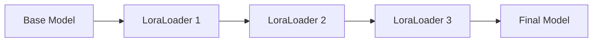
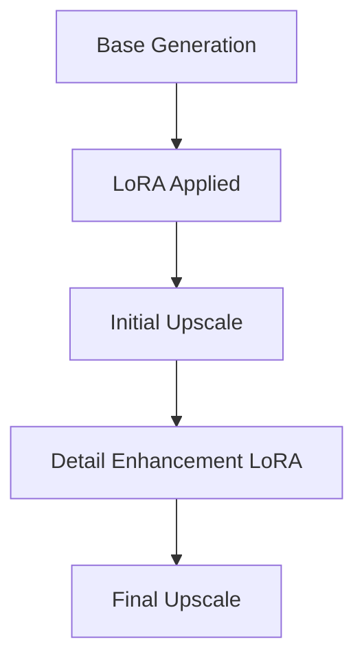

# ComfyUI LoRA Workflow Guide: Best Practices for Realistic Image Generation

## Table of Contents
1. [Core LoRA Concepts in ComfyUI](#core-lora-concepts-in-comfyui)
2. [Essential Nodes for LoRA Workflows](#essential-nodes-for-lora-workflows)
3. [LoRA Loading and Management](#lora-loading-and-management)
4. [Advanced LoRA Techniques](#advanced-lora-techniques)
5. [Workflow Optimization Strategies](#workflow-optimization-strategies)
6. [Custom Node Recommendations](#custom-node-recommendations)
7. [Best Practices for Realistic Generation](#best-practices-for-realistic-generation)
8. [Troubleshooting Common Issues](#troubleshooting-common-issues)

## Core LoRA Concepts in ComfyUI

### What are LoRAs?
LoRAs (Low-Rank Adaptations) are lightweight model modifications that can:
- Add specific styles, characters, or concepts to your generations
- Require minimal VRAM compared to full model fine-tuning
- Be combined and stacked for complex effects
- Work with both the MODEL and CLIP components

### LoRA Types Supported
ComfyUI supports all major LoRA variants:
- **Standard LoRAs**: Traditional low-rank adaptations
- **LyCORIS**: Including LoHa, LoKr, LoConv variants
- **LoCon**: Convolution-based LoRAs
- **DoRA**: Direction of Optimization LoRAs

## Essential Nodes for LoRA Workflows

### Built-in LoRA Nodes

#### 1. LoraLoader
```
Basic LoRA loading node
- Inputs: model, clip, lora_name, strength_model, strength_clip
- Outputs: model, clip
- Use: Single LoRA loading with separate model/CLIP strengths
```

#### 2. LoraLoaderModelOnly
```
Model-only LoRA loading
- Inputs: model, lora_name, strength_model
- Outputs: model
- Use: When you only need model modifications (no text encoding changes)
```

### Advanced LoRA Management Nodes

#### 3. Power Lora Loader (rgthree-comfy)
```
Multi-LoRA management in single node
- Features:
  * Load multiple LoRAs simultaneously
  * Individual toggle switches for each LoRA
  * Strength adjustment per LoRA
  * Drag-and-drop reordering
  * Quick enable/disable functionality
```

#### 4. LoRA Stack Systems
Various custom nodes provide LoRA stacking capabilities:
- Allows sequential LoRA application
- Maintains clean workflow organization
- Enables complex LoRA combinations

## LoRA Loading and Management

### File Organization
```
ComfyUI/
├── models/
│   └── loras/
│       ├── characters/
│       ├── styles/
│       ├── clothing/
│       └── concepts/
```

### Loading Best Practices

#### Sequential Loading


#### Strength Guidelines
- **Character LoRAs**: 0.7-1.0 strength
- **Style LoRAs**: 0.5-0.8 strength
- **Concept LoRAs**: 0.3-0.7 strength
- **Clothing/Objects**: 0.6-0.9 strength

### Multiple LoRA Combination Strategies

#### 1. Hierarchical Loading
```
Primary Character LoRA (1.0) → 
Style LoRA (0.6) → 
Detail Enhancement LoRA (0.4)
```

#### 2. Balanced Combination
```
Character A (0.8) + Character B (0.6) + Style (0.5)
```

#### 3. Style-First Approach
```
Art Style (0.8) → Character (0.9) → Details (0.3)
```

## Advanced LoRA Techniques

### LoRA Strength Scheduling
Using custom nodes for dynamic strength adjustment:
```python
# Example strength progression
start_strength = 0.8
end_strength = 0.4
# Gradual strength reduction through generation steps
```

### LoRA Blending Methods

#### 1. Additive Blending
- Multiple LoRAs applied sequentially
- Effects accumulate and combine
- Best for complementary styles/concepts

#### 2. Weighted Averaging
- Custom nodes can average LoRA effects
- Useful for style interpolation
- Reduces overfitting from strong LoRAs

#### 3. Conditional Application
- Use switches and muting for conditional LoRA loading
- A/B testing different combinations
- Dynamic workflow branching

### Regional LoRA Application
Advanced techniques using masks and regional conditioning:
- Apply different LoRAs to different image regions
- Character-specific LoRAs for multi-character scenes
- Background vs. foreground style separation

## Workflow Optimization Strategies

### Memory Management
```python
# Optimize VRAM usage
--lowvram          # For 6GB+ cards
--normalvram       # Standard usage
--highvram         # For 12GB+ cards
--cpu              # CPU-only mode
```

### Efficient Node Organization

#### Context System (rgthree-comfy)
```
Context Node Benefits:
- Pass multiple connections through single pipes
- Reduce visual complexity
- Enable easy workflow switching
- Maintain connection organization
```

#### Fast Muter/Bypasser System
```
Benefits:
- Quick enable/disable of LoRA branches
- A/B testing capabilities
- Workflow experimentation
- Performance optimization
```

### Batch Processing Optimization
- Use batch nodes for multiple variations
- Queue management for efficient processing
- Seed control for consistent comparisons

## Custom Node Recommendations

### Essential Custom Node Packs

#### 1. rgthree-comfy
```
Key Features:
- Power Lora Loader: Multi-LoRA management
- Context/Context Switch: Workflow organization
- Fast Muter: Quick toggling
- Seed control: Advanced seed management
```

#### 2. ComfyUI Manager
```
Features:
- Easy custom node installation
- Model management
- Workflow template access
```

#### 3. Efficiency Nodes
```
Features:
- LoRA Stack nodes
- Efficient loaders
- Batch processing tools
```

### Specialized LoRA Nodes

#### IPAdapter Plus Integration
- Combine LoRAs with image conditioning
- Style transfer with character consistency
- Reference image + LoRA combinations

#### ControlNet + LoRA Workflows
- Pose control with character LoRAs
- Style LoRAs with composition control
- Multi-layer conditioning systems

## Best Practices for Realistic Generation

### Character Consistency

#### Multi-Angle Character Shots
```workflow
Character LoRA (0.9) + 
Pose ControlNet + 
Consistent Seed + 
High-quality base model
```

#### Expression Control
```
Emotion LoRA (0.6) + 
Character LoRA (0.8) + 
Face detail enhancement (0.4)
```

### Realistic Style Combinations

#### Photorealism Stack
```
1. High-quality base model (SDXL/SD1.5 realistic)
2. Photography style LoRA (0.7)
3. Lighting enhancement LoRA (0.4)
4. Detail enhancement LoRA (0.3)
5. Skin texture LoRA (0.5)
```

#### Environmental Realism
```
Character LoRA (0.8) + 
Environment LoRA (0.6) + 
Lighting style LoRA (0.5) + 
Weather/atmosphere LoRA (0.4)
```

### Quality Enhancement Techniques

#### Upscaling Workflows


#### Detail Refinement
- Use lower strength detail LoRAs (0.2-0.4)
- Layer multiple detail enhancements
- Progressive strength reduction

### Prompt Engineering with LoRAs

#### LoRA Trigger Words
```
Format: <lora:lora_name:strength>
Best Practice: Use LoRA-specific trigger words in prompts
Example: "portrait of woman, <lora:realistic_skin:0.6>, detailed skin texture"
```

#### Weight Balancing
```
Strong LoRA effects: Lower prompt weights (0.6-0.8)
Subtle LoRA effects: Higher prompt weights (0.8-1.2)
```

## Troubleshooting Common Issues

### Memory Issues
```
Solutions:
1. Use --lowvram flag
2. Reduce batch sizes
3. Lower LoRA strengths
4. Use LoraLoaderModelOnly when possible
5. Enable model offloading
```

### Quality Issues

#### Over-application
```
Symptoms: Distorted features, unnatural colors
Solutions:
- Reduce LoRA strengths
- Use fewer simultaneous LoRAs
- Check LoRA compatibility
```

#### Under-application
```
Symptoms: Minimal LoRA effect
Solutions:
- Increase LoRA strength
- Check trigger words in prompt
- Verify LoRA placement in chain
```

#### Conflict Resolution
```
LoRA conflicts:
- Use LoRA precedence (later in chain = higher priority)
- Adjust relative strengths
- Use LoRA exclusion groups
```

### Workflow Debugging

#### Node Chain Validation
```
1. Check all connections are valid
2. Verify LoRA file paths
3. Test individual LoRAs first
4. Use Display Any nodes for debugging
```

#### Performance Optimization
```
1. Monitor VRAM usage
2. Use efficient batch sizes
3. Implement proper muting strategies
4. Optimize node placement
```

## Advanced Workflow Examples

### Multi-Character Consistency Workflow
```
Base Model → 
Character A LoRA (0.8) → 
Character B LoRA (0.6) → 
Scene Style LoRA (0.5) → 
Regional masking for character placement
```

### Style Transfer with Character Preservation
```
Character LoRA (1.0) → 
IPAdapter (reference style) → 
Style LoRA (0.4) → 
Detail enhancement (0.3)
```

### Dynamic LoRA Switching
```
Context Switch →
├── Portrait Mode (Portrait LoRAs)
├── Action Mode (Action LoRAs)
└── Artistic Mode (Style LoRAs)
```

## Conclusion

Effective LoRA usage in ComfyUI requires:
1. **Understanding LoRA types and compatibility**
2. **Proper strength management and combinations**
3. **Efficient workflow organization**
4. **Strategic use of custom nodes**
5. **Systematic testing and iteration**

By following these best practices and leveraging the powerful custom node ecosystem, you can create sophisticated workflows that produce consistent, high-quality realistic images with complex LoRA combinations.